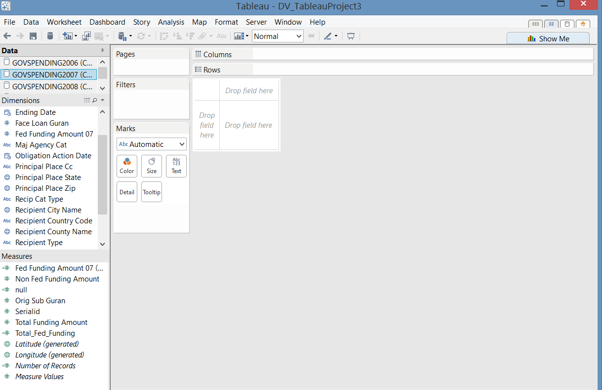
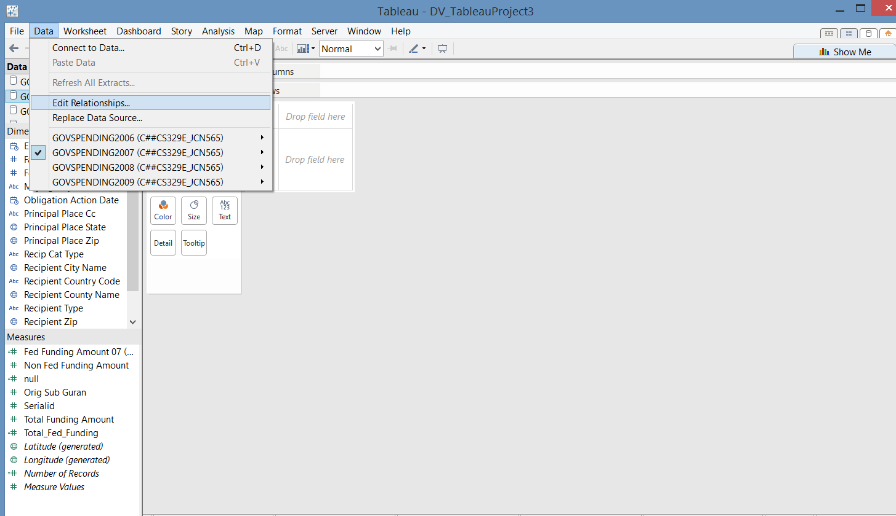
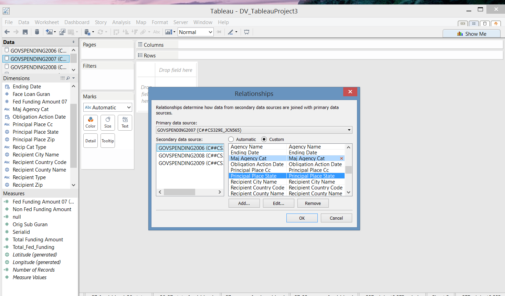
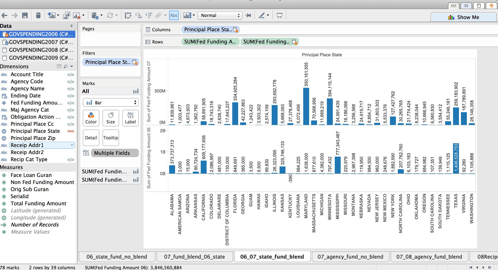
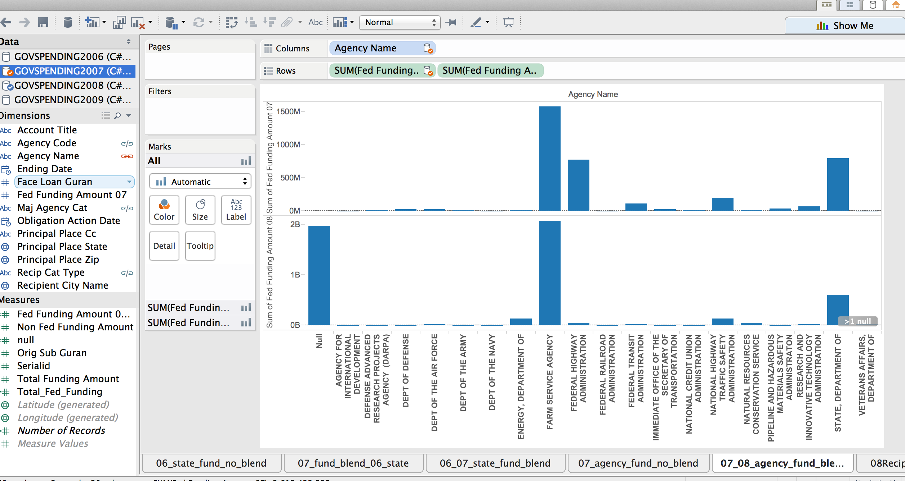
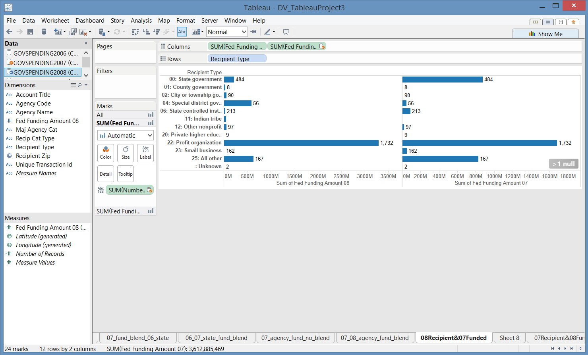
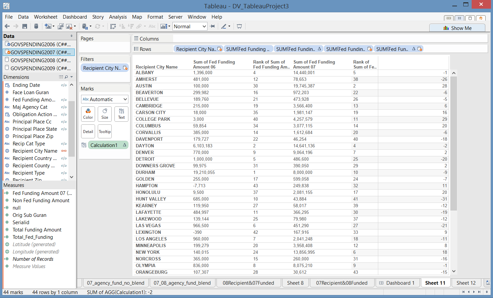

####__1. Loading of R packages: knitr (R code not shown)__

The only package required for Project 6 is knitr to display our work. The project analysis and creation of visuals were created in Tableau.

```{r, include=FALSE}
library(knitr)

```

####__2. Data__
Dataset: GOVSPENDING2006(161 obs), GOVSPENDING2007(3024 obs), GOVSPENDING2008(4896 obs), GOVSPENDING2009(3194 obs), CENSUSCOUNTY(3194 obs)

Description of data:
Every year, the US Federal Government allocates money into different areas such as grants, contracts, loans, insurance, direct payments, and others.The US Federal Website breaks the funding into different datasets available publicly based on the category of funding. For this project, we will concentrate on the Federal Spending - Others which include federal spending on items that were originally not budgeted for in the fiscal year. Below describes the types of funding from the federal government in the "Others" category:

A. New assistance action (new program initiatves)

B. Continuation (funding in succeeding budget period which stemmed from prior agreement to fund amount of the current action)

C. Revision (any change in Federal Government's financial obligation or contingent liability in existing assistance transaction amount)

D. Funding adjustment to completed project

[DATA FEEDS AND ARCHIVES DATA DICTIONARY](http://www.usaspending.gov/sites/all/themes/usaspendingv2/Archives_Data_Feeds_Data_Dictionary.pdf) provides additional information on the following data

In order to support further analysis, we are using census data to determine efficacy of the funding.

Oracle SQL Developer: C##CS329E_JCN565


Project 6 Requirements can be found [here](http://www.cs.utexas.edu/~cannata/dataVis/Projects/Tableau%20Project%203/Project%20Requirements.html).

####__3. Analysis and Visualization__


All data blending was created in Tableau, a data visualization program. Below will break down the steps on how we analyzed our data using data blending. 

1. Connecting to datasets in one worksheet.


2. Each visual is blended based on four different categories: State, City, Funding Agency, and Recipient Type. Our project also blends between different years of datasource. Once under 'Edit Relations', we are able to choose between which primary datasource and secondary datasource and then determine which relationship we blended on. Primary datasource is indicated by a blue circle with a checkmark under 'Data' and secondary datasource will be indicated with an orange circle with a checkmark.




3. Below are the four interesting data blending plots generated by the steps above.


I. This plot is created by blending the GOVSPENDING2007 with GOVSPENDING2006 linking by the Principal Place State in GOVSPENDING2006. From this plot, we can clearly see how the funding in each state (in 2006) changed from 2006 to 2007.





II. This plot is created by blending the GOVSPENDING2008 with GOVSPENDING2007 linking by the Agency Name in GOVSPENDING2007. From this plot, we can clearly see how the funding expenditure in each Agency (in 2007) changed from 2007 to 2008.





III. This plot is created by blending GOVSPENDING2008 with GOVSPENDING2008 linking by Recipient Type. The plot depicts recipients who were funded in 2008 and displays their funding in 2007 and 2008. One interesting note about this plot is that Indian Tribes were not funded in 2007 but in 2008. In 2008, the tribes were funded about 53 million dollars for something. This is interesting because one could then do more research to determine what was being funded and if it was a particular tribe that need money. It also shows the consistancy in funding between 2007 and 2008 for all other recipient types.



Iv. This plot is created by blending GOVSPENDING2006 with GOVSPENDING2007 linking by Recipient City. The visual shows a sum total for each city in 2006 and 2007 as well a the ranking of funding amount for that year. To the right hand of the visual is the difference between rankings. A negative rank nmber means that the funding was less in 2007 than it was in 2006. What is really interesting is the funding for cities that jump significantly from one year to another. An example would be Austin which was funded 100 thousand dollars in 2006 and then funded 19.8 million dollars the following year. With more time, we could have broken this down into the types of funding in Austin in 2007 that required such a large funding from the federal government. 



