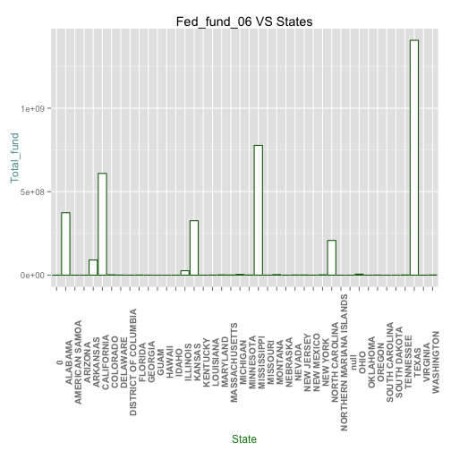
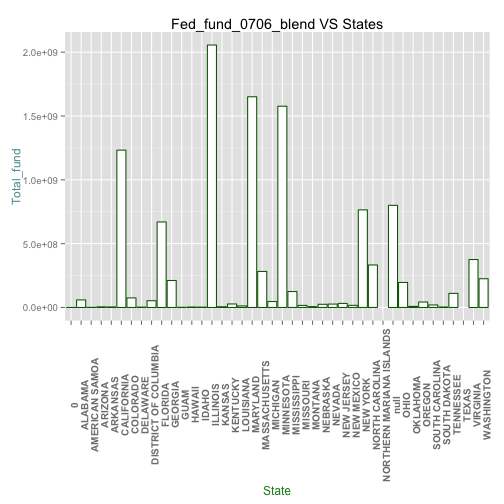
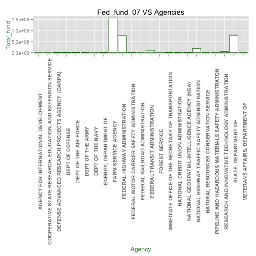
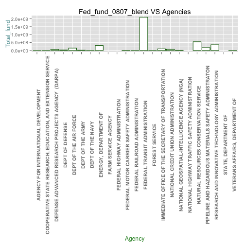

####__1. Loading of R packages: RCurl, ggplot2, extrafont, jsonlite, dplyr, tidyr, extrafont, jsonlite, reshape2 (R code not shown)__


####__2. Data__
Dataset: GOVSPENDING2006(161 obs), GOVSPENDING2007(3024 obs), GOVSPENDING2008(4896 obs), GOVSPENDING2009(3194 obs), CENSUSCOUNTY(3194 obs)

Description of data:
Every year, the US Federal Government allocates money into different areas such as grants, contracts, loans, insurance, direct payments, and others.The US Federal Website breaks the funding into different datasets available publicly based on the category of funding. For this project, we will concentrate on the Federal Spending - Others which include federal spending on items that were originally not budgeted for in the fiscal year. Below describes the types of funding from the federal government in the "Others" category:

A. New assistance action (new program initiatves)

B. Continuation (funding in succeeding budget period which stemmed from prior agreement to fund amount of the current action)

C. Revision (any change in Federal Government's financial obligation or contingent liability in existing assistance transaction amount)

D. Funding adjustment to completed project

[DATA FEEDS AND ARCHIVES DATA DICTIONARY](http://www.usaspending.gov/sites/all/themes/usaspendingv2/Archives_Data_Feeds_Data_Dictionary.pdf) provides additional information on the following data

In order to support further analysis, we are using census data to determine efficacy of the funding.

Oracle SQL Developer: C##CS329E_JCN565

####__3. Analysis and visuals__

#### load data in 

```r
source("../01 Data/df_06.R",echo = T)
```

```
## 
## > df_06 <- data.frame(fromJSON(getURL(URLencode("129.152.144.84:5001/rest/native/?query=\"select * from GOVSPENDING2006\""), 
## +     httpheader = c(DB  .... [TRUNCATED]
```

```r
tbl_df(df_06)
```

```
## Source: local data frame [161 x 26]
## 
##               UNIQUE_TRANSACTION_ID ACCOUNT_TITLE
## 1  e3de047550aec610222209d0a898fa48          null
## 2  78c176a32903954b17e3f493f0c628f0          null
## 3  b180b4bcbc24a427a21fb28c396024c9          null
## 4  cc3eca56946bb44ec487bbce36b3aab6          null
## 5  b72f3b6c16ff40e006ffa3db0d1f41ea          null
## 6  07f21250f6eca0a9de40b67d63c7280d          null
## 7  3fe0c277a4c6bcb5515589f43d0ea134          null
## 8  4b3c3f74d3e8f58ef775dcc9b4cc24f6          null
## 9  8741b74e9b6851920410b6d60beb262e          null
## 10 67ca0c352a2fed3d95d8247539e60979          null
## ..                              ...           ...
## Variables not shown: RECIPIENT_NAME (fctr), RECIPIENT_CITY_NAME (fctr),
##   RECIPIENT_COUNTY_NAME (fctr), RECIPIENT_ZIP (fctr), RECIPIENT_TYPE
##   (fctr), AGENCY_CODE (fctr), FED_FUNDING_AMOUNT_06 (int),
##   NON_FED_FUNDING_AMOUNT (int), TOTAL_FUNDING_AMOUNT (int),
##   OBLIGATION_ACTION_DATE (fctr), STARTING_DATE (fctr), ENDING_DATE (fctr),
##   PRINCIPAL_PLACE_STATE (fctr), PRINCIPAL_PLACE_CC (fctr),
##   PRINCIPAL_PLACE_ZIP (fctr), AGENCY_NAME (fctr), RECEIP_ADDR1 (fctr),
##   RECEIP_ADDR2 (fctr), FACE_LOAN_GURAN (int), ORIG_SUB_GURAN (int),
##   RECIP_CAT_TYPE (fctr), MAJ_AGENCY_CAT (fctr), RECIPIENT_COUNTRY_CODE
##   (fctr), SERIALID (int)
```

```r
source("../01 Data/df_07.R",echo = T)
```

```
## 
## > df_07 <- data.frame(fromJSON(getURL(URLencode("129.152.144.84:5001/rest/native/?query=\"select * from GOVSPENDING2007\""), 
## +     httpheader = c(DB  .... [TRUNCATED]
```

```r
tbl_df(df_07)
```

```
## Source: local data frame [3,024 x 23]
## 
##               UNIQUE_TRANSACTION_ID
## 1  f8a9b16565c78476dcec26d6253be6ad
## 2  4e6e97e327b53d719f64e8344ebbf10f
## 3  59fa389ac740124226c3142208924356
## 4  5eabe25ed17d9d74dd043c8ad2d4296e
## 5  76d4281f8fa283b732b60e7e6762d772
## 6  76df696a9674d281df66654b1db9808c
## 7  63973b7e392bc2063cdbcee33aab37ab
## 8  ec1962fc4d197e67517dfa4cdd0dcb82
## 9  091cdbc45a46864f8d3c977f9b5207a3
## 10 d91c5f680011c7be0b107cfe74ba71ff
## ..                              ...
## Variables not shown: ACCOUNT_TITLE (fctr), RECIPIENT_CITY_NAME (fctr),
##   RECIPIENT_COUNTY_NAME (fctr), RECIPIENT_ZIP (fctr), RECIPIENT_TYPE
##   (fctr), AGENCY_CODE (fctr), FED_FUNDING_AMOUNT_07 (int),
##   NON_FED_FUNDING_AMOUNT (int), TOTAL_FUNDING_AMOUNT (int),
##   OBLIGATION_ACTION_DATE (fctr), STARTING_DATE (fctr), ENDING_DATE (fctr),
##   PRINCIPAL_PLACE_STATE (fctr), PRINCIPAL_PLACE_CC (fctr),
##   PRINCIPAL_PLACE_ZIP (fctr), AGENCY_NAME (fctr), FACE_LOAN_GURAN (int),
##   ORIG_SUB_GURAN (int), RECIP_CAT_TYPE (fctr), MAJ_AGENCY_CAT (fctr),
##   RECIPIENT_COUNTRY_CODE (fctr), SERIALID (int)
```

```r
source("../01 Data/df_08.R",echo = T)
```

```
## 
## > df_08 <- data.frame(fromJSON(getURL(URLencode("129.152.144.84:5001/rest/native/?query=\"select * from GOVSPENDING2008\""), 
## +     httpheader = c(DB  .... [TRUNCATED]
```

```r
tbl_df(df_08)
```

```
## Source: local data frame [4,896 x 9]
## 
##               UNIQUE_TRANSACTION_ID
## 1  08d66e98fd7db327996f838fa561623e
## 2  58c766583a6c5a284a6f2f3650dccf4f
## 3  57e56b2df0988fc5b560129c53c3d088
## 4  db00d5d99ad419ecca0e83dab8915299
## 5  0f6cd859b1dbf40f4ff84e7f15191a7c
## 6  4e017e9aeea0080b07449510e270bb00
## 7  8c87cfd5925bdf72c9f93a8d67adabe3
## 8  56ea528a56ade4d912ee5a752e38702c
## 9  bb9bd703821efc304c935a6771126ae8
## 10 59f17815d6a5372f2c90c1589ba0e1d8
## ..                              ...
## Variables not shown: ACCOUNT_TITLE (fctr), RECIPIENT_ZIP (fctr),
##   RECIPIENT_TYPE (fctr), AGENCY_CODE (fctr), FED_FUNDING_AMOUNT_08 (int),
##   AGENCY_NAME (fctr), RECIP_CAT_TYPE (fctr), MAJ_AGENCY_CAT (fctr)
```

#### get df_06_fund_by_state and plot

```r
df_06_state_fund <- df_06 %>% select(PRINCIPAL_PLACE_STATE,FED_FUNDING_AMOUNT_06) %>% filter(PRINCIPAL_PLACE_STATE != '0' && PRINCIPAL_PLACE_STATE != 'null') %>% group_by(PRINCIPAL_PLACE_STATE) %>% summarise(total_fund = sum(FED_FUNDING_AMOUNT_06)) # bug can not get rid of 0

df_06_state_fund %>% ggplot(aes(x=PRINCIPAL_PLACE_STATE, y=total_fund)) + geom_bar(stat="identity",fill="white",colour="darkgreen") + theme(axis.text.x=element_text(angle=90, size=20, vjust=0.5)) + theme(axis.text.x=element_text(size=10, face="bold", vjust=1)) + theme(axis.title.x=element_text(color="forestgreen", vjust=0.35),axis.title.y=element_text(color="cadetblue", vjust=0.35)) + labs(title="Fed_fund_06 VS States",y="Total_fund",x="State")
```

 

#### then blend df_07 with df_06 linking by PRINCIPAL_PLACE_STATE in df_06 to get 07_06_state_fund_blend (Same as df_06 left join df_07 by PRINCIPAL_PLACE_STATE)

```r
df_0706_blendBystate <- left_join(df_06,df_07,by='PRINCIPAL_PLACE_STATE') %>% select(PRINCIPAL_PLACE_STATE,FED_FUNDING_AMOUNT_07) %>% filter(PRINCIPAL_PLACE_STATE != '0' && PRINCIPAL_PLACE_STATE != 'null') %>% group_by(PRINCIPAL_PLACE_STATE) %>% summarise(total_fund = sum(FED_FUNDING_AMOUNT_07))
# bug can not get rid of 0 and there is null??

df_0706_blendBystate %>% ggplot(aes(x=PRINCIPAL_PLACE_STATE, y=total_fund)) + geom_bar(stat="identity",fill="white",colour="darkgreen") + theme(axis.text.x=element_text(angle=90, size=20, vjust=0.5)) + theme(axis.text.x=element_text(size=10, face="bold", vjust=1)) + theme(axis.title.x=element_text(color="forestgreen", vjust=0.35),axis.title.y=element_text(color="cadetblue", vjust=0.35)) + labs(title="Fed_fund_0706_blend VS States",y="Total_fund",x="State")
```

 

#### get df_07_agency_fund and plot

```r
df_07_agency_fund <- df_07 %>% select(AGENCY_NAME,FED_FUNDING_AMOUNT_07) %>% filter(AGENCY_NAME != '0' && AGENCY_NAME != 'null') %>% group_by(AGENCY_NAME) %>% summarise(total_fund = sum(FED_FUNDING_AMOUNT_07))
df_07_agency_fund %>% ggplot(aes(x=AGENCY_NAME, y=total_fund)) + geom_bar(stat="identity",fill="white",colour="darkgreen") + theme(axis.text.x=element_text(angle=90, size=20, vjust=0.5)) + theme(axis.text.x=element_text(size=10, face="bold", vjust=1)) + theme(axis.title.x=element_text(color="forestgreen", vjust=0.35),axis.title.y=element_text(color="cadetblue", vjust=0.35)) + labs(title="Fed_fund_07 VS Agencies",y="Total_fund",x="Agency")
```

 

#### then Blend df_08 with df_07 linking by agencies in df_07 to get 08_07_agency_fund_blend (Same as df_07 left join df_08 by AGENCY_NAME)

```r
df_0807_blendByagency <- left_join(df_07,df_08,by='AGENCY_NAME') %>% select(AGENCY_NAME,FED_FUNDING_AMOUNT_07) %>% filter(AGENCY_NAME != '0' && AGENCY_NAME != 'null') %>% group_by(AGENCY_NAME) %>% summarise(total_fund = sum(FED_FUNDING_AMOUNT_07))

df_0807_blendByagency %>% ggplot(aes(x=AGENCY_NAME, y=total_fund)) + geom_bar(stat="identity",fill="white",colour="darkgreen") + theme(axis.text.x=element_text(angle=90, size=20, vjust=0.5)) + theme(axis.text.x=element_text(size=10, face="bold", vjust=1)) + theme(axis.title.x=element_text(color="forestgreen", vjust=0.35),axis.title.y=element_text(color="cadetblue", vjust=0.35)) + labs(title="Fed_fund_0807_blend VS Agencies",y="Total_fund",x="Agency")
```

 
