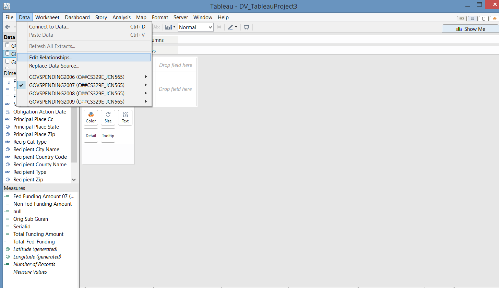
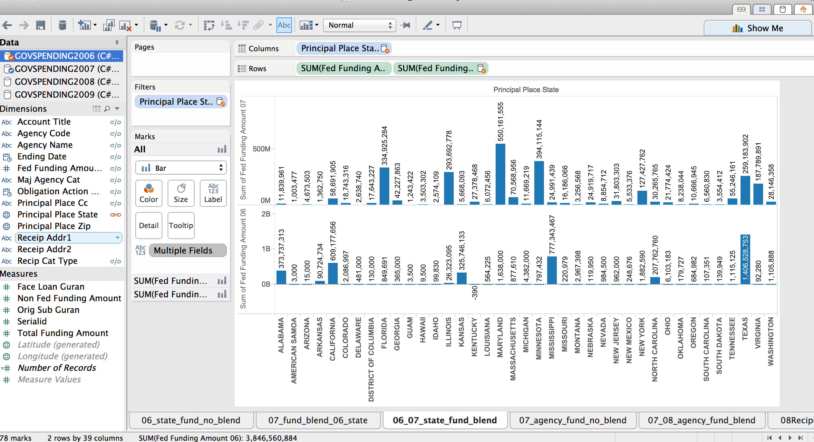
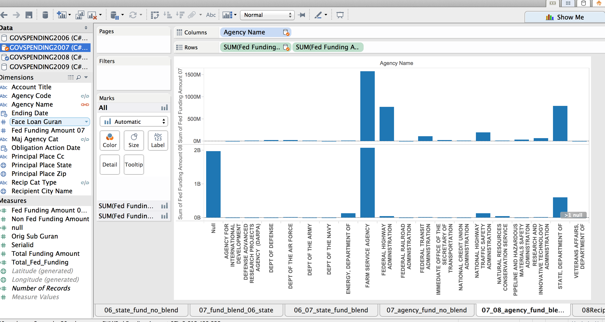

####__1. Loading of R packages: RCurl, ggplot2, extrafont, jsonlite, dplyr, tidyr, extrafont, jsonlite, reshape2 (R code not shown)__

####__2. Data__
Dataset: GOVSPENDING2006(161 obs), GOVSPENDING2007(3024 obs), GOVSPENDING2008(4896 obs), GOVSPENDING2009(3194 obs), CENSUSCOUNTY(3194 obs)

Description of data:
Every year, the US Federal Government allocates money into different areas such as grants, contracts, loans, insurance, direct payments, and others.The US Federal Website breaks the funding into different datasets available publicly based on the category of funding. For this project, we will concentrate on the Federal Spending - Others which include federal spending on items that were originally not budgeted for in the fiscal year. Below describes the types of funding from the federal government in the "Others" category:

A. New assistance action (new program initiatves)

B. Continuation (funding in succeeding budget period which stemmed from prior agreement to fund amount of the current action)

C. Revision (any change in Federal Government's financial obligation or contingent liability in existing assistance transaction amount)

D. Funding adjustment to completed project

[DATA FEEDS AND ARCHIVES DATA DICTIONARY](http://www.usaspending.gov/sites/all/themes/usaspendingv2/Archives_Data_Feeds_Data_Dictionary.pdf) provides additional information on the following data

In order to support further analysis, we are using census data to determine efficacy of the funding.

Oracle SQL Developer: C##CS329E_JCN565

####__3. Analysis and visuals__

All data blending was created in Tableau. Below will break down the steps on how we analyzed our data using data blending. 

1. Connecting to datasets in one worksheet.

2. Each visual is blended based on four different categories: State, City, Funding Agency, and Recipient Type. Our project also blends between different years of datasource.

3. The image below shows the screen in which we select the different categories to blend.

#### Below are the four interesting data blending plots generated by the steps above.

I. This plot is created by blending the GOVSPENDING2007 with GOVSPENDING2006 linking by the Principal Place State in GOVSPENDING2006. From this plot, we can clearly see how the funding in each state (in 2006) changed from 2006 to 2007.

III. This plot is created by blending the GOVSPENDING2008 with GOVSPENDING2007 linking by the Agency Name in GOVSPENDING2007. From this plot, we can clearly see how the funding expenditure in each Agency (in 2007) changed from 2007 to 2008.

